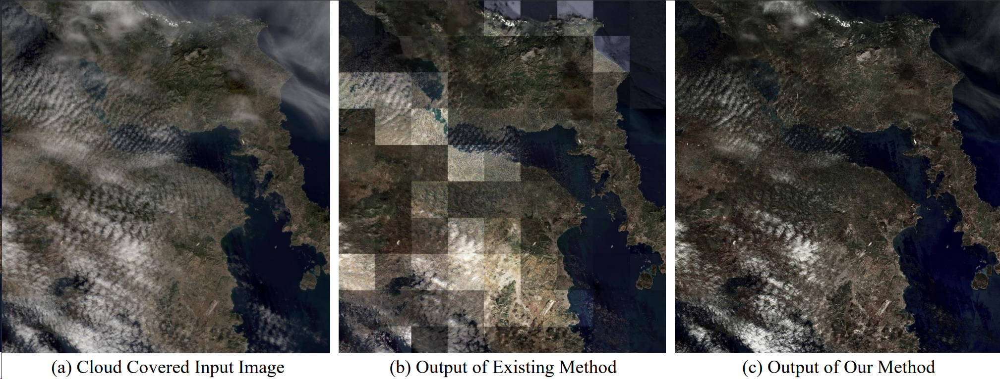
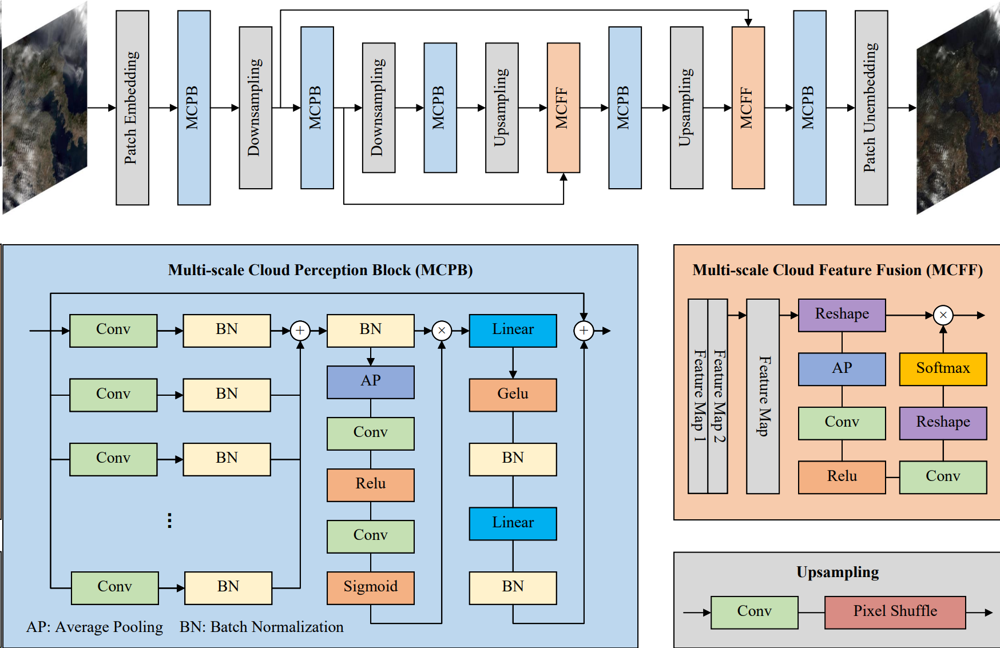

#  FFA-Net: Feature Fusion Attention Network for Single Image Dehazing
 Official implementation.

---

by Mingkai Li, Qizhi Xu et al. Beijing Institute of Technology

### Introduction



Cloud cover leads to loss of details in multispectral images,significantly impacting their satellite application value. Many existing methods and datasets are primarily tailored for dehazing, exhibiting suboptimal performance when applied to declouding tasks and suffering from color disparities across patches, especially in the context of wide-swath images.
To address this problem, a DecloudNet based on cross-patch consistency supervision was proposed. First, a Multi-sacle Cloud Perception Block (MCPB) with multi-scaled convolutional kernels was proposed to enhance the network's capability to extract clouds feature of different sizes. Second, a cross-patch consistency supervision was designed to expose the network's inconsistent declouding strength in different patches and remove inter-patch color disparity when processing wide-swath images. Finally, a Perlin noise-based multi-shape cloud simulation method was proposed to construct high-quality decloud datasets containing simulated clouds of multiple sizes and shapes. The experiment results demonstrated that DecloudNet outperformed the state-of-the-art (SOTA) methods.



### Usage
#### Test

Trained_models are available at google drive: https://drive.google.com/file/d/1H-iEAT94sYso07W4PDmEOWhGU9gZ-Xgy/view?usp=sharing

*Put  models in the `trained_models/` folder.*

*Test images are in `test_imgs/` folder.*

 ```shell
 python test.py 
```